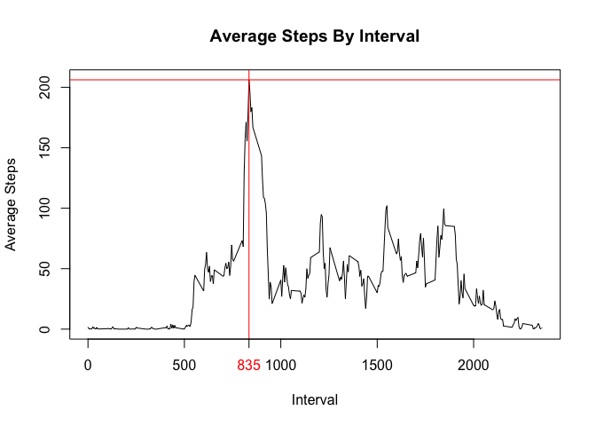
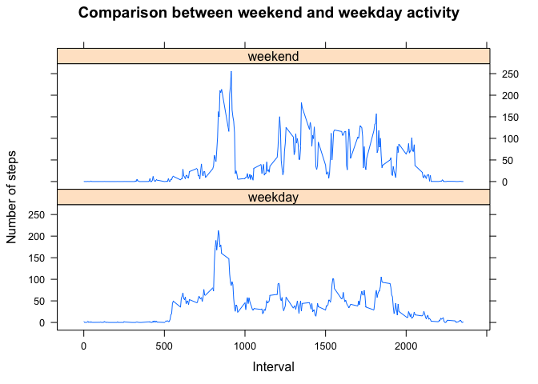

# Reproducible Research Peer Assignment 1
Prasad Kodibagkar  
July 19, 2015  

This assignment makes use of data from a personal activity monitoring device. This device collects data at 5 minute intervals through out the day. The data consists of two months of data from an anonymous individual collected during the months of October and November, 2012 and include the number of steps taken in 5 minute intervals each day.

### Data

The data for this assignment can be downloaded from the course web site:

Dataset: [Activity monitoring data](https://d396qusza40orc.cloudfront.net/repdata%2Fdata%2Factivity.zip) [52K]  
The variables included in this dataset are:  
  
steps: Number of steps taking in a 5-minute interval (missing values are coded as NA)
  
date: The date on which the measurement was taken in YYYY-MM-DD format
  
interval: Identifier for the 5-minute interval in which measurement was taken
  
The dataset is stored in a comma-separated-value (CSV) file and there are a total of 17,568 observations in this dataset.


```r
# PA1_template.R
##
## 

# load libraries
library(dplyr)
```

```
## 
## Attaching package: 'dplyr'
## 
## The following objects are masked from 'package:stats':
## 
##     filter, lag
## 
## The following objects are masked from 'package:base':
## 
##     intersect, setdiff, setequal, union
```

```r
library(lattice)
```

Initialize common variables

```r
srcDir <- "/Users/prasadkodibagkar/Documents/Data Science/workspace/RepData_PeerAssessment1"
dataDir <- "/Users/prasadkodibagkar/Documents/Data Science/workspace/RepData_PeerAssessment1"
activityDataFile <- "activity.csv"
```

### Loading and preprocessing the data
Load activity File and filter missing values

```r
activityDF <- read.csv(paste(dataDir,"/", activityDataFile,sep = ""))

str(activityDF)
```

```
## 'data.frame':	17568 obs. of  3 variables:
##  $ steps   : int  NA NA NA NA NA NA NA NA NA NA ...
##  $ date    : Factor w/ 61 levels "2012-10-01","2012-10-02",..: 1 1 1 1 1 1 1 1 1 1 ...
##  $ interval: int  0 5 10 15 20 25 30 35 40 45 ...
```

```r
# Filter the observations with missing values

cleanActivityDF <- activityDF[!is.na(activityDF$steps),]
```

Summarize Steps by day

```r
activitySummaryByDate <- cleanActivityDF %>%
    group_by(date) %>%
    summarize(daily_steps = sum(steps))
```

### What is mean total number of steps taken per day?
Plot a histogram for the daily steps  

```r
hist(activitySummaryByDate$daily_steps, col="red",xlab="Total Steps", main="Total number of steps by day" )
```

 

  Calculate the mean value for daily steps


```r
mean(activitySummaryByDate$daily_steps)
```

```
## [1] 10766.19
```

Calculate the median value for daily steps


```r
median(activitySummaryByDate$daily_steps)
```

```
## [1] 10765
```

### What is the average daily activity pattern?

Create a time series plot (i.e. type = "l") of the 5-minute interval (x-axis) and the average number of steps taken, 
averaged across all days (y-axis)

Summarize Steps by day

```r
activitySummaryByInterval <- cleanActivityDF %>%
    group_by(interval) %>%
    summarize(avg_steps = mean(steps))
```

Calculate the max average steps

```r
max(activitySummaryByInterval$avg_steps)
```

```
## [1] 206.1698
```
Calculate the interval with the max average steps

```r
activitySummaryByInterval[activitySummaryByInterval$avg_steps == max(activitySummaryByInterval$avg_steps),]$interval
```

```
## [1] 835
```
Plot the average steps by interval and add a line showing the interval with the max average steps

```r
plot(activitySummaryByInterval$interval, activitySummaryByInterval$avg_steps,type="l", 
     xlab= "Interval", ylab= "Average Steps", main="Average Steps By Interval", col="black" , lwd=1)

abline(v=activitySummaryByInterval[activitySummaryByInterval$avg_steps == max(activitySummaryByInterval$avg_steps),]$interval, 
       h=max(activitySummaryByInterval$avg_steps), col="red")
axis(1, at= activitySummaryByInterval[activitySummaryByInterval$avg_steps == max(activitySummaryByInterval$avg_steps),]$interval,
     col.axis="red")
```

 

### Imputing missing values

Calculate and report the total number of missing values in the dataset (i.e. the total number of rows with NAs)

```r
nrow(activityDF[is.na(activityDF$steps),])
```

```
## [1] 2304
```

Copy and create an Imputed Data frame

```r
imputedActivityDF <- activityDF
```
Fill missing values in the dataset mean steps for that 5 minute interval 

Define function to get mean steps for a specific 5 minute interval

```r
getAverageStepsForInterval <- function(intvl){
    return(activitySummaryByInterval[activitySummaryByInterval$interval==intvl,][["avg_steps"]])
}
```
Iterate and set missing values with mean steps for that interval

```r
for ( i in 1:nrow(imputedActivityDF))
{
    if (is.na(imputedActivityDF[i,"steps"])) {
        imputedActivityDF[i,"steps"] <- getAverageStepsForInterval(imputedActivityDF[i,"interval"])
    }
}
```

Summarize Steps by day


```r
imputedActivitySummary <- imputedActivityDF %>%
    group_by(date) %>%
    summarize(daily_steps = sum(steps))
```

Plot a histogram for the daily steps

```r
hist(imputedActivitySummary$daily_steps, col="red",xlab="Total Steps", main="Total number of steps by day" )
```

 
  
Calculate the mean value for daily steps

```r
mean(imputedActivitySummary$daily_steps)
```

```
## [1] 10766.19
```
Calculate the median value for daily steps

```r
median(imputedActivitySummary$daily_steps)
```

```
## [1] 10766.19
```
As it can be seen from the mean and median values, imputing the missing values has made the mean and median values to be equal.

### Are there differences in activity patterns between weekdays and weekends?

Add a factor variable with two levels -- "weekday" and "weekend"

```r
imputedActivityDF <- imputedActivityDF %>%
    transform(day_of_week = ifelse(as.numeric(format(as.Date(date),"%w")) <=5 ,"weekday","weekend"))
```
Summarize Steps by weekdays and interval

```r
imputedActivitySummaryByWeekday <- imputedActivityDF %>%
    group_by(day_of_week,interval) %>%
    summarize(avg_steps = mean(steps))
```
Panel Plot of average steps by interval to compare weekday and weekend activity

```r
xyplot(avg_steps ~ interval | day_of_week, data = imputedActivitySummaryByWeekday,layout = c(1,2),type="l"
       ,xlab="Interval",ylab="Number of steps",main="Comparison between weekend and weekday activity")
```

 
